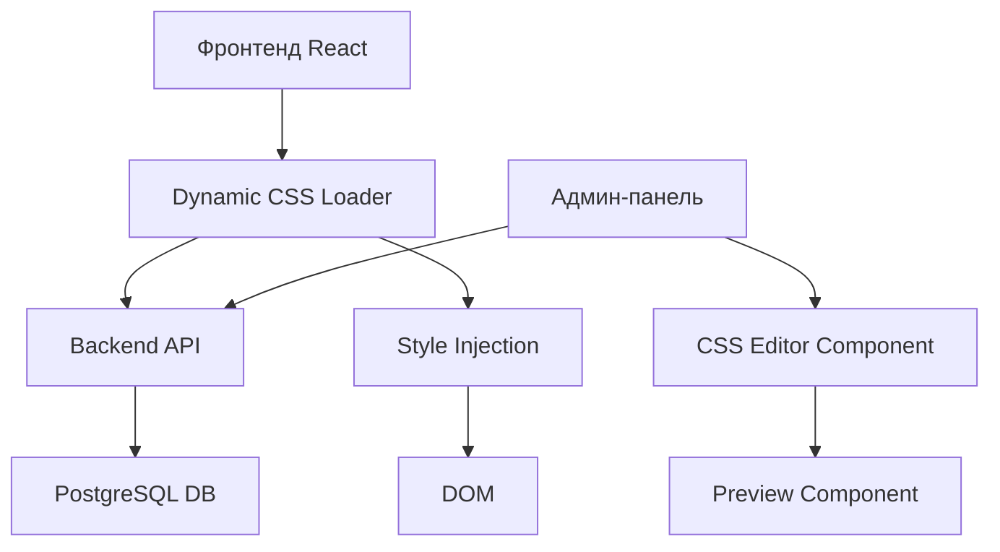

# Мастер-план: Система динамического управления CSS

**Дата создания:** 23 января 2026  
**Проект:** Pixel59 - Vite React ShadCN TypeScript  
**Цель:** Создание системы управления CSS через админ-панель с возможностью динамического применения стилей без пересборки фронтенда

---

## 📋 Обзор проблемы

### Текущая ситуация
1. **Неудобная отладка CSS**: Классы компонентов не имеют явных признаков принадлежности к конкретным блокам
2. **Необходимость пересборки**: Любые изменения CSS требуют пересборки фронтенда
3. **Отсутствие гибкости**: Нет возможности быстро менять стили через админ-панель

### Примеры текущих классов
```tsx
// AboutUs.tsx
<section id="about-us" className="about-us bg-gray-50 dark:bg-gray-700">
  <div className="about-us-left space-y-6 sm:space-y-8">
  <div className="about-us-right lg:pt-[316px] pt-0 min-h-full space-y-6">

// Development.tsx  
<section id="blok-dev" className="blok-dev bg-white dark:bg-gray-800">
  <div className="blok-dev-left space-y-4 sm:space-y-6 lg:space-y-8">
  <div className="blok-dev-right lg:pt-[316px] pt-0 min-h-full space-y-6">

// Promotion.tsx
<section id="promotion" className="promotion bg-gray-50 dark:bg-gray-700">
  <div className="promotion-left space-y-8">
  <div className="promotion-right lg:pt-[316px] pt-0 min-h-full space-y-6">
```

---

## 🎯 Цели проекта

### 1. Улучшение структуры CSS классов
- Внедрить BEM-подобную методологию для всех компонентов
- Добавить префиксы компонентов для легкой идентификации
- Обеспечить консистентность именования

### 2. Создание системы динамического CSS
- Хранение CSS правил в базе данных PostgreSQL
- Backend API для CRUD операций с CSS
- Применение стилей без пересборки фронтенда
- Превью изменений в реальном времени

### 3. Админ-панель для управления CSS
- Интерфейс редактирования CSS по блокам
- Синтаксическая подсветка кода
- Превью изменений
- История изменений
- Возможность отката

---

## 🏗️ Архитектура решения

### Компоненты системы



### Структура данных

#### Таблица: `custom_css_blocks`
```sql
CREATE TABLE custom_css_blocks (
    id SERIAL PRIMARY KEY,
    block_name VARCHAR(100) UNIQUE NOT NULL,
    component_name VARCHAR(100) NOT NULL,
    css_content TEXT NOT NULL,
    is_active BOOLEAN DEFAULT true,
    priority INTEGER DEFAULT 0,
    created_at TIMESTAMP DEFAULT CURRENT_TIMESTAMP,
    updated_at TIMESTAMP DEFAULT CURRENT_TIMESTAMP,
    created_by VARCHAR(100),
    description TEXT
);

CREATE INDEX idx_block_name ON custom_css_blocks(block_name);
CREATE INDEX idx_component_name ON custom_css_blocks(component_name);
CREATE INDEX idx_is_active ON custom_css_blocks(is_active);
```

#### Таблица: `css_change_history`
```sql
CREATE TABLE css_change_history (
    id SERIAL PRIMARY KEY,
    block_id INTEGER REFERENCES custom_css_blocks(id),
    css_content_before TEXT,
    css_content_after TEXT,
    changed_by VARCHAR(100),
    changed_at TIMESTAMP DEFAULT CURRENT_TIMESTAMP,
    change_description TEXT
);
```

---

## 📦 Этапы реализации

### Этап 1: Рефакторинг CSS классов (2-3 дня)
**Цель:** Добавить BEM-подобные классы ко всем компонентам

**Компоненты для обработки:**
- AboutUs.tsx
- Development.tsx
- Promotion.tsx
- Services.tsx
- Hero.tsx
- News.tsx
- Portfolio.tsx
- FAQ.tsx
- Contacts.tsx
- Footer.tsx
- HowItWorks.tsx

**Пример трансформации:**
```tsx
// Было:
<section className="about-us bg-gray-50">
  <div className="about-us-left space-y-6">
    <h2 className="section-title">О Нас</h2>

// Стало:
<section className="about-us about-us__section bg-gray-50">
  <div className="about-us__container">
    <div className="about-us__left about-us__content-block space-y-6">
      <h2 className="about-us__title section-title">О Нас</h2>
```

### Этап 2: База данных и Backend API (3-4 дня)
**Цель:** Создать API для управления CSS

**Endpoints:**
- `GET /api/css-blocks` - Получить все блоки CSS
- `GET /api/css-blocks/:blockName` - Получить конкретный блок
- `POST /api/css-blocks` - Создать новый блок
- `PUT /api/css-blocks/:id` - Обновить блок
- `DELETE /api/css-blocks/:id` - Удалить блок
- `GET /api/css-blocks/active` - Получить активные блоки для применения
- `GET /api/css-blocks/:id/history` - История изменений блока
- `POST /api/css-blocks/:id/rollback/:historyId` - Откатить изменения

### Этап 3: Динамический загрузчик CSS (2 дня)
**Цель:** Реализовать загрузку и применение CSS без пересборки

**Компоненты:**
- `DynamicCSSLoader.tsx` - Загрузчик CSS
- `useDynamicCSS.ts` - React hook для управления
- Интеграция в `App.tsx`

### Этап 4: Админ-панель CSS Editor (4-5 дней)
**Цель:** Создать интерфейс для редактирования CSS

**Компоненты:**
- `CSSManagement.tsx` - Главная страница управления
- `CSSBlockEditor.tsx` - Редактор блока
- `CSSPreview.tsx` - Превью изменений
- `CSSHistory.tsx` - История изменений

**Библиотеки:**
- `@monaco-editor/react` или `react-codemirror` для редактора кода
- Синтаксическая подсветка CSS
- Автодополнение

### Этап 5: Тестирование и документация (2 дня)
**Цель:** Проверить работоспособность и создать документацию

---

## 🔧 Технический стек

### Frontend
- React 18.2
- TypeScript 5.4
- TailwindCSS 3.4
- React Router 6.22
- Axios для API запросов
- Monaco Editor / CodeMirror для редактора CSS

### Backend
- Python 3.x
- PostgreSQL (существующая БД)
- Существующая архитектура serverless functions

### База данных
- PostgreSQL (pixel_db)
- 2 новые таблицы: `custom_css_blocks`, `css_change_history`

---

## 📊 Оценка сложности

| Этап | Сложность | Риски |
|------|-----------|-------|
| Рефакторинг классов | Средняя | Возможны визуальные баги |
| Backend API | Низкая | Стандартный CRUD |
| Динамический загрузчик | Средняя | Проблемы с производительностью |
| Админ-панель | Высокая | Сложный UI/UX |
| Тестирование | Средняя | Регрессионные баги |

---

## ⚠️ Важные замечания

### Безопасность
1. **Валидация CSS**: Проверка на вредоносный код
2. **Санитизация**: Очистка от потенциально опасных конструкций
3. **Права доступа**: Только администраторы могут редактировать CSS
4. **Аудит**: Логирование всех изменений

### Производительность
1. **Кэширование**: Кэширование CSS на клиенте
2. **Минификация**: Минификация CSS перед отправкой
3. **Lazy loading**: Загрузка только активных блоков
4. **CDN**: Возможность использования CDN для статического CSS

### Совместимость
1. **Не ломать существующий функционал**: Все изменения должны быть обратно совместимы
2. **Fallback**: Если динамический CSS не загрузился, использовать базовые стили
3. **Тестирование**: Проверка на всех поддерживаемых браузерах

---

## 📝 Критерии успеха

1. ✅ Все компоненты имеют BEM-подобные классы
2. ✅ CSS можно редактировать через админ-панель
3. ✅ Изменения применяются без пересборки фронтенда
4. ✅ Есть превью изменений
5. ✅ Есть история изменений и возможность отката
6. ✅ Система безопасна и производительна
7. ✅ Существующий функционал не сломан
8. ✅ Есть полная документация

---

## 🚀 План запуска

### Подготовка
1. Создание резервной копии БД
2. Создание ветки в Git
3. Подготовка тестового окружения

### Развертывание
1. Применение миграций БД
2. Деплой backend функций
3. Деплой фронтенда
4. Тестирование на продакшене

### Откат (если нужно)
1. Откат миграций БД
2. Откат к предыдущей версии кода
3. Очистка кэша

---

## 📚 Дополнительные материалы

### Полезные ссылки
- [BEM Methodology](https://en.bem.info/methodology/)
- [CSS-in-JS vs CSS](https://css-tricks.com/css-in-js/)
- [Monaco Editor React](https://github.com/suren-atoyan/monaco-react)
- [PostgreSQL Text Search](https://www.postgresql.org/docs/current/textsearch.html)

### Примеры реализации
- WordPress Customizer
- Webflow CSS Editor
- Framer CSS Override

---

## 👥 Команда и роли

- **Frontend Developer**: Рефакторинг компонентов, создание админ-панели
- **Backend Developer**: API, валидация, безопасность
- **QA Engineer**: Тестирование, регрессионное тестирование
- **DevOps**: Деплой, мониторинг, резервное копирование

---

## 📅 Временная шкала

**Общая длительность:** 13-16 дней

- **Неделя 1**: Этапы 1-2 (Рефакторинг + Backend)
- **Неделя 2**: Этапы 3-4 (Загрузчик + Админ-панель)
- **Неделя 3**: Этап 5 (Тестирование + Документация)

---

## 🎓 Обучение команды

После завершения проекта:
1. Документация по использованию системы
2. Видео-туториал для администраторов
3. Best practices по работе с CSS
4. Troubleshooting guide

---

**Статус:** 📝 В планировании  
**Следующий шаг:** Создание промптов для AI агентов
