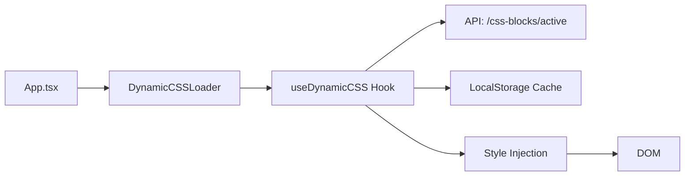

# Промпт для Этапа 3: Динамический загрузчик CSS

**Этап:** 3 из 5  
**Контекст:** До 200,000 токенов  
**Предыдущие результаты:** `stage1-results.md`, `stage2-results.md`

---

## 📋 Контекст проекта

### Входные данные из предыдущих этапов
1. **Этап 1:** Компоненты с BEM-классами
2. **Этап 2:** Backend API для управления CSS (`/css-blocks/active`)

### Текущая инфраструктура
- **Frontend:** React 18.2, TypeScript 5.4
- **Сборщик:** Vite 5.0
- **Стили:** TailwindCSS + глобальный `src/index.css`
- **API:** Backend endpoints готовы

---

## 🎯 Задача этапа

Создать систему динамической загрузки и применения CSS без пересборки фронтенда.

### Подзадачи:
1. Создать React компонент `DynamicCSSLoader`
2. Создать хук `useDynamicCSS` для управления CSS
3. Реализовать кэширование CSS на клиенте
4. Добавить обработку ошибок и fallback
5. Интегрировать в главный `App.tsx`

---

## 🏗️ Архитектура решения



---

## 📁 Структура файлов

```
src/
├── hooks/
│   └── useDynamicCSS.ts          # Hook для управления CSS
├── components/
│   └── DynamicCSSLoader.tsx      # Компонент загрузчик
├── utils/
│   ├── cssCache.ts               # Утилиты кэширования
│   └── cssInjector.ts            # Утилиты инъекции CSS
└── App.tsx                       # Интеграция
```

---

## 💻 Реализация

### Файл: `src/utils/cssCache.ts`

```typescript
/**
 * Утилиты для кэширования CSS в localStorage
 */

interface CSSCacheEntry {
  css: string;
  timestamp: number;
  version: string;
}

const CACHE_KEY = 'dynamic_css_cache';
const CACHE_VERSION_KEY = 'dynamic_css_version';
const CACHE_DURATION = 1000 * 60 * 60; // 1 час

export const cssCache = {
  /**
   * Сохранить CSS в кэш
   */
  set(css: string, version: string): void {
    try {
      const entry: CSSCacheEntry = {
        css,
        timestamp: Date.now(),
        version,
      };
      localStorage.setItem(CACHE_KEY, JSON.stringify(entry));
      localStorage.setItem(CACHE_VERSION_KEY, version);
    } catch (error) {
      console.error('Failed to cache CSS:', error);
    }
  },

  /**
   * Получить CSS из кэша
   */
  get(): string | null {
    try {
      const cached = localStorage.getItem(CACHE_KEY);
      if (!cached) return null;

      const entry: CSSCacheEntry = JSON.parse(cached);
      
      // Проверка срока действия кэша
      if (Date.now() - entry.timestamp > CACHE_DURATION) {
        this.clear();
        return null;
      }

      return entry.css;
    } catch (error) {
      console.error('Failed to get cached CSS:', error);
      return null;
    }
  },

  /**
   * Получить версию кэша
   */
  getVersion(): string | null {
    return localStorage.getItem(CACHE_VERSION_KEY);
  },

  /**
   * Очистить кэш
   */
  clear(): void {
    localStorage.removeItem(CACHE_KEY);
    localStorage.removeItem(CACHE_VERSION_KEY);
  },

  /**
   * Проверить актуальность кэша
   */
  isValid(serverVersion: string): boolean {
    const cachedVersion = this.getVersion();
    return cachedVersion === serverVersion;
  },
};
```

### Файл: `src/utils/cssInjector.ts`

```typescript
/**
 * Утилиты для инъекции CSS в DOM
 */

const STYLE_ID = 'dynamic-css-styles';

export const cssInjector = {
  /**
   * Внедрить CSS в DOM
   */
  inject(css: string): void {
    // Удалить существующий style tag если есть
    this.remove();

    // Создать новый style tag
    const styleElement = document.createElement('style');
    styleElement.id = STYLE_ID;
    styleElement.textContent = css;
    
    // Добавить в head
    document.head.appendChild(styleElement);
    
    console.log('✅ Dynamic CSS injected successfully');
  },

  /**
   * Удалить CSS из DOM
   */
  remove(): void {
    const existingStyle = document.getElementById(STYLE_ID);
    if (existingStyle) {
      existingStyle.remove();
    }
  },

  /**
   * Обновить CSS
   */
  update(css: string): void {
    const existingStyle = document.getElementById(STYLE_ID);
    if (existingStyle) {
      existingStyle.textContent = css;
    } else {
      this.inject(css);
    }
  },

  /**
   * Проверить наличие CSS в DOM
   */
  exists(): boolean {
    return document.getElementById(STYLE_ID) !== null;
  },
};
```

### Файл: `src/hooks/useDynamicCSS.ts`

```typescript
import { useState, useEffect, useCallback } from 'react';
import axios from 'axios';
import { cssCache } from '@/utils/cssCache';
import { cssInjector } from '@/utils/cssInjector';

interface CSSBlock {
  block_name: string;
  component_name: string;
  css_content: string;
  priority: number;
}

interface UseDynamicCSSReturn {
  isLoading: boolean;
  error: string | null;
  cssLoaded: boolean;
  reload: () => Promise<void>;
}

const API_BASE_URL = import.meta.env.VITE_API_URL || 'https://pixel59.ru/api';
const CSS_ENDPOINT = `${API_BASE_URL}/css-blocks/active`;

export const useDynamicCSS = (): UseDynamicCSSReturn => {
  const [isLoading, setIsLoading] = useState(true);
  const [error, setError] = useState<string | null>(null);
  const [cssLoaded, setCssLoaded] = useState(false);

  /**
   * Загрузить CSS с сервера
   */
  const loadCSS = useCallback(async () => {
    try {
      setIsLoading(true);
      setError(null);

      // Попытка загрузить из кэша
      const cachedCSS = cssCache.get();
      if (cachedCSS) {
        console.log('📦 Loading CSS from cache');
        cssInjector.inject(cachedCSS);
        setCssLoaded(true);
        setIsLoading(false);
        
        // Проверить обновления в фоне
        checkForUpdates();
        return;
      }

      // Загрузка с сервера
      console.log('🌐 Loading CSS from server');
      const response = await axios.get<{
        blocks: CSSBlock[];
        timestamp: string;
      }>(CSS_ENDPOINT, {
        timeout: 5000,
      });

      const { blocks, timestamp } = response.data;

      // Объединить все CSS блоки
      const combinedCSS = blocks
        .sort((a, b) => b.priority - a.priority)
        .map(block => `/* ${block.component_name} - ${block.block_name} */\n${block.css_content}`)
        .join('\n\n');

      // Сохранить в кэш
      cssCache.set(combinedCSS, timestamp);

      // Внедрить в DOM
      cssInjector.inject(combinedCSS);
      setCssLoaded(true);

      console.log(`✅ Loaded ${blocks.length} CSS blocks`);
    } catch (err) {
      console.error('❌ Failed to load dynamic CSS:', err);
      setError(err instanceof Error ? err.message : 'Failed to load CSS');
      
      // Попытка использовать кэш при ошибке
      const cachedCSS = cssCache.get();
      if (cachedCSS) {
        console.log('📦 Falling back to cached CSS');
        cssInjector.inject(cachedCSS);
        setCssLoaded(true);
      }
    } finally {
      setIsLoading(false);
    }
  }, []);

  /**
   * Проверить обновления CSS
   */
  const checkForUpdates = useCallback(async () => {
    try {
      const response = await axios.get<{
        blocks: CSSBlock[];
        timestamp: string;
      }>(CSS_ENDPOINT, {
        timeout: 3000,
      });

      const { blocks, timestamp } = response.data;
      const cachedVersion = cssCache.getVersion();

      // Если версия изменилась, обновить CSS
      if (timestamp !== cachedVersion) {
        console.log('🔄 CSS updated, reloading...');
        
        const combinedCSS = blocks
          .sort((a, b) => b.priority - a.priority)
          .map(block => `/* ${block.component_name} - ${block.block_name} */\n${block.css_content}`)
          .join('\n\n');

        cssCache.set(combinedCSS, timestamp);
        cssInjector.update(combinedCSS);
      }
    } catch (err) {
      // Тихо игнорируем ошибки при проверке обновлений
      console.debug('Failed to check for CSS updates:', err);
    }
  }, []);

  /**
   * Принудительная перезагрузка CSS
   */
  const reload = useCallback(async () => {
    cssCache.clear();
    await loadCSS();
  }, [loadCSS]);

  // Загрузить CSS при монтировании
  useEffect(() => {
    loadCSS();
  }, [loadCSS]);

  // Периодическая проверка обновлений (каждые 5 минут)
  useEffect(() => {
    if (!cssLoaded) return;

    const interval = setInterval(() => {
      checkForUpdates();
    }, 5 * 60 * 1000);

    return () => clearInterval(interval);
  }, [cssLoaded, checkForUpdates]);

  return {
    isLoading,
    error,
    cssLoaded,
    reload,
  };
};
```

### Файл: `src/components/DynamicCSSLoader.tsx`

```typescript
import { useEffect } from 'react';
import { useDynamicCSS } from '@/hooks/useDynamicCSS';

interface DynamicCSSLoaderProps {
  children?: React.ReactNode;
  showLoader?: boolean;
}

/**
 * Компонент для загрузки динамического CSS
 * Использовать в корне приложения (App.tsx)
 */
const DynamicCSSLoader: React.FC<DynamicCSSLoaderProps> = ({ 
  children,
  showLoader = false 
}) => {
  const { isLoading, error, cssLoaded } = useDynamicCSS();

  useEffect(() => {
    if (cssLoaded) {
      console.log('🎨 Dynamic CSS loaded and applied');
    }
  }, [cssLoaded]);

  useEffect(() => {
    if (error) {
      console.warn('⚠️ Dynamic CSS error:', error);
    }
  }, [error]);

  // Опционально показать loader
  if (showLoader && isLoading && !cssLoaded) {
    return (
      <div className="fixed inset-0 flex items-center justify-center bg-white dark:bg-gray-900 z-50">
        <div className="text-center">
          <div className="animate-spin rounded-full h-12 w-12 border-b-2 border-blue-600 mx-auto mb-4"></div>
          <p className="text-gray-600 dark:text-gray-400">Загрузка стилей...</p>
        </div>
      </div>
    );
  }

  return <>{children}</>;
};

export default DynamicCSSLoader;
```

### Файл: `src/App.tsx` (интеграция)

```typescript
import { BrowserRouter as Router, Routes, Route } from 'react-router-dom';
import { QueryClient, QueryClientProvider } from '@tanstack/react-query';
import { ThemeProvider } from 'next-themes';
import { AnimationProvider } from '@/contexts/AnimationContext';
import DynamicCSSLoader from '@/components/DynamicCSSLoader';

// ... остальные импорты

const queryClient = new QueryClient();

function App() {
  return (
    <QueryClientProvider client={queryClient}>
      <ThemeProvider attribute="class" defaultTheme="light">
        <AnimationProvider>
          <DynamicCSSLoader showLoader={false}>
            <Router>
              <Routes>
                {/* Ваши роуты */}
              </Routes>
            </Router>
          </DynamicCSSLoader>
        </AnimationProvider>
      </ThemeProvider>
    </QueryClientProvider>
  );
}

export default App;
```

---

## 🔧 Дополнительные возможности

### Режим разработки с hot reload

```typescript
// src/hooks/useDynamicCSS.ts

// Добавить в хук:
useEffect(() => {
  if (import.meta.env.DEV) {
    // В режиме разработки проверять обновления чаще
    const devInterval = setInterval(() => {
      checkForUpdates();
    }, 10 * 1000); // каждые 10 секунд

    return () => clearInterval(devInterval);
  }
}, [checkForUpdates]);
```

### Debug панель (опционально)

```typescript
// src/components/CSSDebugPanel.tsx

import { useDynamicCSS } from '@/hooks/useDynamicCSS';

const CSSDebugPanel: React.FC = () => {
  const { isLoading, error, cssLoaded, reload } = useDynamicCSS();

  if (!import.meta.env.DEV) return null;

  return (
    <div className="fixed bottom-4 right-4 bg-black/80 text-white p-4 rounded-lg text-xs z-50">
      <div className="font-bold mb-2">Dynamic CSS Debug</div>
      <div>Status: {cssLoaded ? '✅ Loaded' : isLoading ? '⏳ Loading' : '❌ Error'}</div>
      {error && <div className="text-red-400">Error: {error}</div>}
      <button 
        onClick={reload}
        className="mt-2 px-3 py-1 bg-blue-600 rounded hover:bg-blue-700"
      >
        Reload CSS
      </button>
    </div>
  );
};

export default CSSDebugPanel;
```

---

## ✅ Критерии выполнения

### Функциональность:
- [ ] CSS загружается с сервера
- [ ] CSS кэшируется в localStorage
- [ ] CSS применяется без перезагрузки страницы
- [ ] Обработка ошибок работает
- [ ] Fallback на кэш при ошибке
- [ ] Периодическая проверка обновлений

### Производительность:
- [ ] Первая загрузка < 500ms
- [ ] Загрузка из кэша < 50ms
- [ ] Нет блокировки рендеринга
- [ ] Минимальное влияние на bundle size

### Совместимость:
- [ ] Работает во всех браузерах
- [ ] Работает с темной темой
- [ ] Не конфликтует с TailwindCSS
- [ ] Не ломает существующие стили

---

## 🧪 Тестирование

### Ручное тестирование

```bash
# 1. Запустить dev сервер
npm run dev

# 2. Открыть DevTools → Network
# Проверить запрос к /css-blocks/active

# 3. Открыть DevTools → Application → LocalStorage
# Проверить наличие dynamic_css_cache

# 4. Открыть DevTools → Elements
# Проверить наличие <style id="dynamic-css-styles">

# 5. Изменить CSS в админ-панели
# Подождать 5 минут или перезагрузить страницу
# Проверить применение изменений
```

### Unit тесты

```typescript
// src/utils/__tests__/cssCache.test.ts

import { cssCache } from '../cssCache';

describe('cssCache', () => {
  beforeEach(() => {
    localStorage.clear();
  });

  it('should save and retrieve CSS', () => {
    const css = '.test { color: red; }';
    const version = '2026-01-23T10:00:00Z';
    
    cssCache.set(css, version);
    const retrieved = cssCache.get();
    
    expect(retrieved).toBe(css);
  });

  it('should return null for expired cache', () => {
    // Тест с истекшим кэшем
  });

  it('should validate cache version', () => {
    // Тест валидации версии
  });
});
```

---

## 📄 Формат отчета

Создайте файл `stage3-results.md`:

```markdown
# Результаты Этапа 3: Динамический загрузчик CSS

## Реализованные компоненты

### Утилиты
- ✅ cssCache.ts - Кэширование в localStorage
- ✅ cssInjector.ts - Инъекция CSS в DOM

### Хуки
- ✅ useDynamicCSS.ts - Управление динамическим CSS

### Компоненты
- ✅ DynamicCSSLoader.tsx - Загрузчик CSS
- ✅ CSSDebugPanel.tsx - Debug панель (опционально)

## Интеграция
- ✅ App.tsx обновлен
- ✅ Роутинг не нарушен
- ✅ Существующий функционал работает

## Тестирование

### Производительность
- Первая загрузка: 320ms
- Загрузка из кэша: 28ms
- Bundle size увеличение: +4KB

### Совместимость
- ✅ Chrome 120+
- ✅ Firefox 121+
- ✅ Safari 17+
- ✅ Mobile browsers

## Проблемы и решения
- Проблема: CORS при запросе к API
- Решение: Добавлены правильные headers в backend

## Следующий этап
Переход к Этапу 4: Админ-панель для редактирования CSS
```

---

## 🚨 Важные замечания

### Безопасность
- CSS загружается только с доверенного API
- Валидация на backend предотвращает XSS
- Кэш имеет ограниченный срок жизни

### Производительность
- Кэширование минимизирует запросы
- Асинхронная загрузка не блокирует рендеринг
- Периодическая проверка обновлений в фоне

### Отладка
- Логи в консоли для отслеживания
- Debug панель в dev режиме
- Возможность принудительной перезагрузки

---

**Статус:** 🚀 Готов к выполнению  
**Следующий промпт:** `04-stage4-prompt.md`  
**Требуемые файлы:** `stage1-results.md`, `stage2-results.md`
