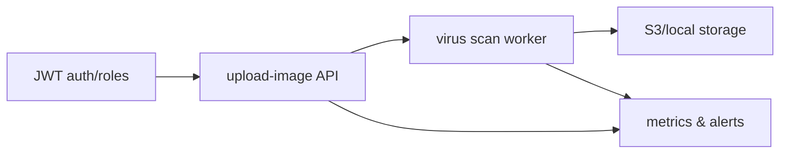

# Промпт: Секреты, партнёры и загрузка файлов

## Контекст
- В stage5 описаны архитектуры и метрики (архитектурная референция `server/api`, хранилища и alerts) [plans/gpt_agents/stage5.md:21-55](plans/gpt_agents/stage5.md:21-55).
- Используй рекомендации для secure-settings, partner-auth, partners и upload-image, чтобы закрыть критические уязвимости и обеспечить стабильность хранения.
- Учитывай CI/CD plan-of-record: lint/test/load/alerts сохранять артефакты в `reports/ci/` и связать с пользовательскими процессами.

## Основные задачи
1. Включить шифрование (Fernet), JWT-авторизацию, роли и аудит для secure-settings, добавить rate limiting и validation, материализованные view для часто используемых категорий и health-check мониторинг.
2. Перевести partner-auth и partners на хеширование паролей, JWT/refresh, rate limiting, логирование попыток, ограничение login и защиту от SQL-инъекций; добавить аудит и версионирование/откаты.
3. Для upload-image внедрить аутентификацию, скан кеша MIME, ограничение 10MB, проверку magic bytes, вирус-скан на фоне, генерацию уникальных имен и retry/ограничение потоков; добавить метрики файлов.
4. Объединить наблюдаемость: метрики использования API, alerts при ошибках шифрования/загрузки, health checks и logging медленных операций.

## Тестирование
- Backend: unit/интеграционные тесты шифрования, JWT, загрузки; E2E на workflow сохранения секретов, авторизации партнёров, загрузки изображения; нагрузка: 100 в секунду для upload-image, alerts на ошибки шифрования.
- Frontend: тесты форм управления секретами и партнёрами (Vitest/Playwright); проверка upload-image UI (разрешённые типы, ошибки сканирования, прогресс), визуализация статусов и alerts.

## Подробный план реализации

### 1. secure-settings
- Перевести `backend/secure-settings/index.py:1-342` на реальное Fernet-шифрование через `get_cipher()` и вывести всё key management/ротацию в отдельный модуль (shared security helper), чтобы подключать его из CI/CD playbook (`plans/gpt_agents/stage5.md:21-55`).
- Реализовать JWT-авторизацию с ролями (admin/viewer) и validation/sanitization ключей и значений (длина, шаблоны для email/url/number) перед persistence; добавлять rate limiting через API Gateway/Express proxy.
- Логировать каждую операцию CRUD с audit метаданными (request_id, user_id, IP, before/after) и сохранять истории версий (`secure_settings_versions`) для возможности отката (`POST /api/secure-settings/rollback`).
- Создать materialized views `secure_settings_by_category` и `secure_settings_recent` + health check `GET /api/secure-settings/health` проверяющий доступ к view и статус rate limiter.
- Экспортировать метрики шифрования/validation failures/rate limit rejects в Prometheus и сохранять JSON-артефакты в `reports/ci/secure-settings-metrics.json` после `lint/test/load` фаз из plan-of-record.

### 2. partner-auth и partners
- Перенести хранение паролей в bcrypt/Argon2 и внедрить JWT access + refresh (с `refresh_id`, `expires_at`, rotation через `secure-settings`). Синхронизировать front-end формы с этими токенами и UI-индикаторами rate limit/lockout.
- Защитить все SQL-запросы parameterized queries и использовать connection pool (`psycopg2.pool.ThreadedConnectionPool`); добавить логирование `partner_auth_log` (success/fail/IP/request headers) и alert при 5%+ failed logins за 5 минут.
- Добавить rate limiting+lockout (например 3 неудачи → 15 мин блокировка) и события аудита для каждой смены состояния партнёра; сохранить версии строк в `partners_versions` со `jsonb payload`, `updated_by`, `request_id`.
- Обновить `partners` API на поддержание JWT аутентификации, refresh endpoint `/api/partner-auth/refresh`, и метрики latency/errors (reports/ci/partner-auth-metrics.json).

### 3. upload-image
- Проверять JWT роли до обработки (`server/middleware/auth.js` или Lambda authorizer); использовать allowed MIME `image/jpeg`, `image/png`, `image/webp`, `application/pdf` и сверять magic bytes (например `ffd8`, `89504e47`, `52494646`) перед декодированием.
- Ограничить payload 10MB (headers + actual payload), возвращать 413/422 при превышении и логировать такие события; запускать retry с exponential backoff (max 3) и ограничивать concurrency (ThreadPoolExecutor семафор, max 8 потоков).
- Внедрить фоновые вирус-сканы (ClamAV/Yara) после загрузки, записывать результаты в `upload_image_metrics`, при заражении удалять файл и генерировать alert, вручную записывая в `reports/ci/upload-image-violations.json`.
- Генерировать уникальные имена (UUID + timestamp), сохранять metadata-лог (request_id, tenant, size, mime) и при S3/локальных ошибках использовать retry/jitter, а в случае фатала отправлять запись в DLQ/`reports/ci/upload-image-failures.json`.

### 4. Наблюдаемость и CI/CD
- Собрать метрики API usage, JWT errors, upload failures и rate limit rejects, сохранять их в `reports/ci/` (secure-settings, partner-auth, upload-image) после `lint/test/load` этапов (`plans/gpt_agents/stage5.md:21-55`).
- Настроить alerts на ошибки шифрования/JWT/upload scan и медленные запросы >400 мс (логировать slow query plan через `backend/_shared/logging.py`). Уведомления отправлять в Slack/webhook/email (`#ci-alerts`, ops@company.ru).
- Добавить health checks (`scripts/health-check.sh`) для secure-settings, partner-auth и upload-image, включая проверку подключения к БД, rate limiter, upload queue depth, и сохранять результаты `reports/ci/health.json`.

### 5. Тестирование
- Backend: unit/интеграционные тесты для шифрования/validation, JWT access/refresh, upload limits, virus scan, audit log, rate limiting.
- E2E: workflow сохранения секретов (create/update/rollback), partner login+refresh+lockout, upload-image (auth, MIME reject, retry, success) с нагрузкой upload-image 100 RPS (Locust) и monitoring latency <400 ms.
- Frontend: Vitest/Playwright проверки secret/partner форм, upload-image UI (allowed MIME, errors, progress, alerts), визуализация статусов и rate limit UI states.
- Регрессионные проверки: alerts/health артефакты (`reports/ci/alerts.json`, `reports/ci/health.json`), retention `secure_settings_versions`, logs `partner_auth_log`.

## Следующие шаги
1. Провести ревью предложенного плана, уточнить недостающие зависимости и согласовать с CI/CD plan-of-record.
2. Подтвердить готовность инфраструктуры (rate limiter, Prometheus, Slack/webhooks) и подготовить задачи на реализацию.
3. После одобрения переключиться в режим code для внесения изменений, собрать lint/test/load и сохранить артефакты в `reports/ci/`.
