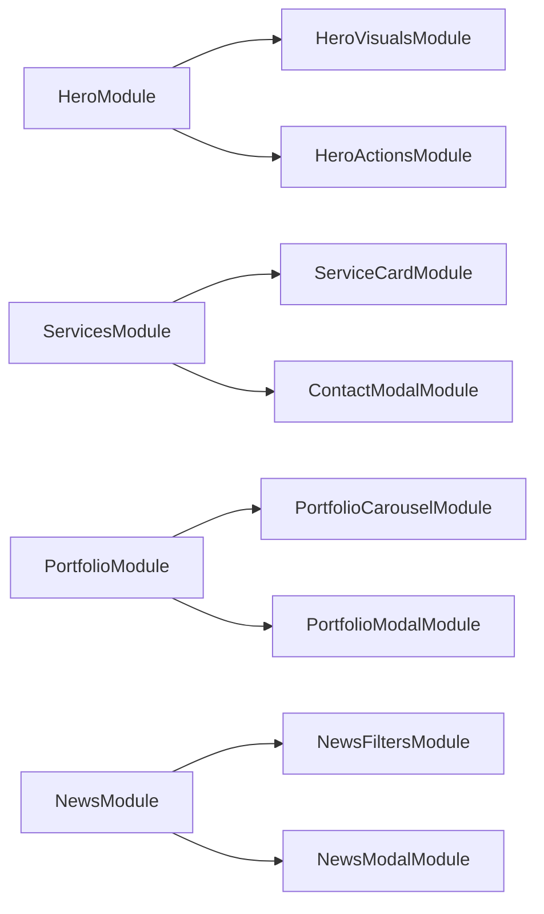

# План декомпозиции фронтенда для читаемости агентами

## Контекст
- главный вход [`src/App.tsx`](src/App.tsx:1) объединяет маршруты для маркетингового сайта и админ-панели, но не разделяет крупные блоки по областям ответственности агента.
- лэндинг [`src/pages/Index.tsx`](src/pages/Index.tsx:1) состоит из многоуровневых секций: [`src/components/Hero.tsx`](src/components/Hero.tsx:1), [`src/components/Services.tsx`](src/components/Services.tsx:1), [`src/components/HowItWorks.tsx`](src/components/HowItWorks.tsx:1), [`src/components/Portfolio.tsx`](src/components/Portfolio.tsx:1), [`src/components/News.tsx`](src/components/News.tsx:1) и прочих, каждый из которых содержит и визуальную логику, и состояния.
- агенты, которым предстоит поддерживать флоу, выигрывают от четкого разделения: презентационные структуры, модалы, асинхронные запросы и повторно используемые хуки и контексты.

## Цели
1. Выделить сложные визуальные блоки (Hero, Services, Portfolio, News) во вложенные подмодули с понятными интерфейсами и минимальными побочными эффектами.
2. Выносить логику работы с данными и модалами в специализированные хук-обёртки или сервисные слои, чтобы агенты могли изменить поведение без погружения в многоуровневые JSX-блоки.
3. Очистить точку входа маршрутов, обособив админскую часть (`AdminProtectedRoute`, страницы `ConsentAdmin`, `Partners`, `Analytics` и т.д.) от маркетинговых страниц для отдельной документации агентам.

## Стратегия декомпозиции

### Модульные сегменты маркетингового лендинга
- `Hero`: вынести фоновые анимации, градиенты и случайные бар-чарты в вспомогательные хуки/компоненты (`useHeroAnimations`, `HeroCanvas`). Раздельные подпапки для `HeroContent`, `HeroActions` и `HeroVisuals` облегчают агенту изменение только нужной части.
- `Services`: разбить карточки, правую поясняющую колонку и модальное окно на независимые компоненты (`ServiceCard`, `ServicesBenefits`, `ContactModal`). Замена данных должна происходить через конфиг `servicesData.ts` и хук `useContactModal`.
- `HowItWorks` и `News`: вынести шаги и карточки в отдельные массивы и компоненты `HowItWorksStep`, `NewsCard`, `NewsGrid`; для фильтрации и модального просмотра — собственные хуки `useNewsFilters`, `useNewsModal`.
- `Portfolio`: отделить загрузку с API (`usePortfolioProjects`), слайдер командующего списка (`PortfolioCarousel`) и модалку (`PortfolioPreview`). Это создаст контракт: агенты управляют данными через `usePortfolioProjects` и только в коде отображения подключают соответствующие слои.

### Админка и маршрутизация
- структурировать `src/pages/*` так, чтобы каждая страница содержала только layout и вызов сервисов, перенесём логику в `components/admin` и `contexts/PartnerContext` и т.п.
- выделить отдельный файл конфигурации маршрутов (`routes/admin.ts`, `routes/public.ts`) и подключать их через итерацию внутри `App`, чтобы добавление новой админ-страницы не требовало изменения основной точки входа.

### Общие контексты и хук-обертки
- контексты `PartnerProvider`, `ThemeProvider`, `AnimationProvider` уже оборачивают всё приложение — задокументировать их ответственность и вспомогательные хуки, например `useThemeConfig`, чтобы агенты знали где искать настройки.
- для асинхронных данных (новости, портфолио) использовать отдельные сервисы и кастомные хуки (`useFetchNews`, `usePortfolioFetch`) с чётко описанными интерфейсами.

## Реализация: этапы
1. Перевести сложные компоненты в подпапки с делением на визуальный слой и слой данных (Hero, Services, Portfolio, News), задокументировать интерфейсы компонентов.
2. Вынести все асинхронные операции в независимые хуки (`usePortfolioFetch`, `useNewsFetch`, `useContactModal`), публиковать их в [`src/hooks`](src/hooks:1) для повторного использования.
3. Рефакторить основное приложение: создать конфигурационные файлы маршрутов, зарегистрировать их через генерацию `<Route>` и обеспечить отдельный layout для админки (`components/AdminLayout`).
4. Обновить документацию (этот файл) с чеклистом по каждому сегменту, перечисляя входные точки (например, путь к каждому компоненту и хук-обертке).
5. Протестировать изменения и упаковать сценарии для агентов — написать инструкции по быстрому запуску страниц и замене данных через отдельные файлы конфигурации.

## Диаграмма декомпозиции

## Следующие шаги
- согласовать этот план с командой, после чего выполнить рефакторинг в отдельной ветке; агенты смогут ориентироваться по этому документу, переходя по ссылкам на связанные компоненты.
