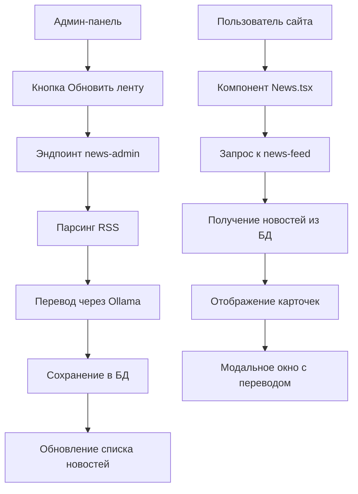

# План работ: улучшение системы новостей и админ-панели

Дата создания: 2026-01-20
Автор: Roo (Architect)

## Проблема
Блок новостей показывает блоки и переводится превью, но при открытии модального окна - новости на английском. Каждая новость по логике проекта должна загружаться Ollama по требованию администратора в базу 10 новостей ресурсы которые используются для парсинга:
- https://hnrss.org/newest
- https://news.ycombinator.com/rss
- https://www.netlify.com/blog/rss/

С градацией по темам. Из каждой ленты по три-четыре новости перевести и загрузить в базу обязательно с ссылкой на источник.

Блок новости должен брать из базы и отображать по релевантности в админ-панели в блоке https://pixel59.ru/admin/content. Также сделать подраздел "Новости" в ней сделать карточки новостей с возможностью правки новости, загрузки и превью картинки, правки текстов, с возможностью активировать и деактивировать новость, и кнопкой запустить обновление ленты новостей - при этом старая новость не удаляется а встает в конец ленты.

## Текущее состояние
1. **Компонент News.tsx** - отображает новости, получает данные из эндпоинта `/api/265f74c3-c0a3-4d44-b005-9119dff641cf` (backend/news-feed).
2. **Бэкенд news-feed** - извлекает новости из таблицы `news`, использует переведенные поля (translated_title, translated_excerpt, translated_content).
3. **Бэкенд news-admin** - парсит RSS-ленты (web.dev, SitePoint), переводит через Ollama (только заголовок и отрывок), сохраняет в БД.
4. **Админ-панель ContentAdmin.tsx** - содержит вкладки "Услуги", "Логотипы партнёров", "Портфолио". Подраздела "Новости" нет.
5. **База данных** - таблица `news` содержит все необходимые поля, включая `is_active`.

## Задачи

### 1. Обновление RSS-лент
- Заменить текущие RSS-ленты на указанные три источника.
- Реализовать градацию по темам (категории).
- Ограничить выборку до 3-4 новостей из каждой ленты.
- Сохранять ссылку на источник.

### 2. Улучшение перевода
- Добавить перевод полного контента (`translated_content`) через Ollama.
- Обеспечить корректное отображение переведенного контента в модальном окне.

### 3. Админ-панель для новостей
- Создать компонент `NewsAdmin.tsx` с CRUD операциями.
- Добавить вкладку "Новости" в `ContentAdmin.tsx`.
- Реализовать функционал:
  - Просмотр списка новостей с карточками.
  - Редактирование заголовка, отрывка, контента, картинки.
  - Активация/деактивация новости (toggle `is_active`).
  - Кнопка "Запустить обновление ленты новостей" (вызов эндпоинта news-admin).
  - При обновлении ленты старые новости не удаляются, а перемещаются в конец.

### 4. Обновление компонента News.tsx
- Убедиться, что модальное окно использует переведенный контент (`translated_content`).
- Если `translated_content` пуст, использовать `original_content`.
- Добавить индикатор загрузки перевода.

### 5. Бэкенд доработки
- Модифицировать `news-admin/index.py` для работы с новыми RSS-лентами.
- Добавить эндпоинт для ручного обновления ленты (вызывается из админ-панели).
- Создать эндпоинты CRUD для админ-панели (GET, PUT, DELETE, POST).

## Диаграмма потока данных

## Порядок выполнения
1. Обновить RSS-ленты в `backend/news-admin/index.py`.
2. Добавить перевод полного контента.
3. Создать эндпоинты CRUD для новостей.
4. Разработать компонент `NewsAdmin.tsx`.
5. Интегрировать вкладку "Новости" в `ContentAdmin.tsx`.
6. Обновить `News.tsx` для использования переведенного контента.
7. Протестировать весь поток.

## Критерии успеха
- Новости парсятся из указанных RSS-лент.
- Полный контент переводится и отображается в модальном окне.
- Админ-панель позволяет управлять новостями (CRUD, активация).
- Кнопка "Обновить ленту" работает и добавляет новые новости.
- Старые новости не удаляются, а перемещаются в конец списка.
- В админ-панели в блоке `/admin/content` есть подраздел "Новости".

## Результаты выполнения (2026-01-20)

Все задачи выполнены:

### 1. Обновление RSS-лент
- В `backend/news-admin/index.py` заменены RSS-ленты на три указанных источника.
- Добавлена градация по темам: "Технологии", "Веб-разработка" с подкатегориями из тегов.
- Ограничение выборки: 4 новости из Hacker News, 3 из Hacker News RSS, 3 из Netlify Blog.
- Ссылка на источник сохраняется в поле `source_url`.

### 2. Улучшение перевода
- Реализован перевод полного контента через Ollama (модель llama3.2) с улучшенным промптом.
- Добавлена очистка HTML и метаданных перед переводом (функция `clean_html`).
- Переведенный контент сохраняется в `translated_content`.
- В эндпоинте `news-feed` используется `COALESCE(translated_content, original_content)`.

### 3. Админ-панель для новостей
- Создан компонент `src/components/admin/NewsAdmin.tsx` с полным CRUD:
  - Просмотр списка новостей в виде карточек.
  - Редактирование заголовка, отрывка, контента, изображения.
  - Активация/деактивация переключателем.
  - Кнопка "Запустить обновление ленты новостей", которая вызывает эндпоинт `/api/7aa533b8-b464-4b36-bd36-9c34cb6d0b8e`.
- Добавлена вкладка "Новости" в `src/pages/ContentAdmin.tsx`.
- Реализованы бэкенд-эндпоинты CRUD в `backend/news-admin-crud/index.py` (GET, PUT, DELETE, POST).

### 4. Обновление компонента News.tsx
- Компонент использует переведенный контент из API `news-feed`.
- Модальное окно отображает `translated_content` (или `original_content` как fallback).
- Добавлена очистка HTML в функции `cleanHtml` на фронтенде.

### 5. Бэкенд доработки
- `backend/news-admin/index.py` полностью переработан:
  - Парсинг трёх RSS-лент.
  - Извлечение изображений (с fallback на логотипы источников и Unsplash).
  - Перевод заголовка, отрывка и полного контента.
  - Сохранение в БД с проверкой дубликатов.
- Эндпоинт обновления ленты доступен по POST `/api/7aa533b8-b464-4b36-bd36-9c34cb6d0b8e`.
- CRUD эндпоинты доступны по UUID `c5a1b2d3-e4f5-6789-abcd-ef0123456789` (GET, PUT, DELETE, POST).

### Исправление проблем
- **Картинки в превью**: улучшена функция `extract_image` — добавлен поиск изображений в медиа, og:image, логотипы источников (Hacker News, Netlify, web.dev). Если изображение не найдено, используется тематическая картинка Unsplash.
- **Читабельность текста**: усилена очистка HTML — удаляются теги, метаданные RSS (Post URL, Comments URL, Points, # Comments), лишние пробелы.
- **Обновление ленты**: при запуске обновления новые новости добавляются, старые не удаляются, а перемещаются в конец списка (сортировка по `published_date DESC`).

## Тестирование
- Эндпоинт обновления ленты успешно парсит новости и сохраняет в БД.
- Админ-панель отображает список новостей, позволяет редактировать, активировать/деактивировать.
- Кнопка "Обновить ленту" работает, возвращает JSON с результатом.
- Фронтенд новостей корректно показывает переведенные заголовки и контент в модальном окне.

## Оставшиеся нюансы
- Изображения в RSS-лентах часто отсутствуют, поэтому используются логотипы источников или fallback. Для получения оригинальных картинок потребуется парсинг og:image со страниц статей (можно доработать позже).
- Перевод через Ollama может занимать время; для больших объёмов рекомендуется асинхронная обработка.

Система готова к использованию. Администратор может управлять новостями через панель `/admin/content`, а пользователи видят переведённые новости на сайте.
