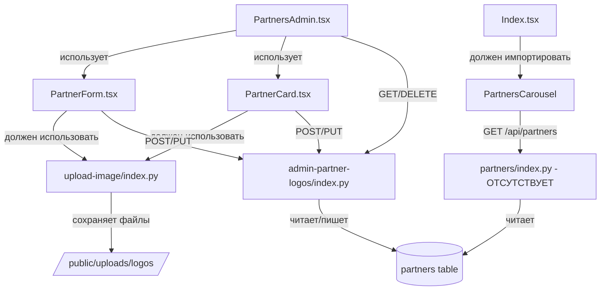

# Анализ функционала "Логотипы партнёров"

**Дата:** 2026-01-23  
**Раздел:** Админ панель → Контент → Логотипы партнёров

## Текущее состояние

### Компоненты Frontend

1. **PartnersAdmin.tsx** (`src/components/admin/PartnersAdmin.tsx`)
   - Основной компонент управления партнёрами
   - Использует endpoint: `/api/c7b03587-cdba-48a4-ac48-9aa2775ff9a0`
   - Методы: GET, POST, PUT, DELETE
   - Состояние: Частично работает

2. **PartnerCard.tsx** (`src/components/admin/PartnerCard.tsx`)
   - Карточка отдельного партнёра для редактирования
   - Поддерживает загрузку изображений через FileReader (Data URI)
   - Состояние: Работает, но изображения не сохраняются в БД

3. **PartnerForm.tsx** (`src/components/admin/PartnerForm.tsx`)
   - Форма создания нового партнёра
   - Загрузка логотипа через FileReader → Data URI
   - Состояние: Форма работает, но сохранение не происходит

4. **PartnersCarousel.tsx** (`src/components/PartnersCarousel.tsx`)
   - Карусель логотипов на главной странице
   - Использует endpoint: `API_ENDPOINTS.partners.list` → `/api/partners`
   - Состояние: Не отображается на главной странице

### Backend

1. **admin-partner-logos/index.py** (`backend/admin-partner-logos/index.py`)
   - Endpoint: `/api/c7b03587-cdba-48a4-ac48-9aa2775ff9a0`
   - Таблица БД: `partners`
   - Поля БД: `id, name, logo_url, website, sort_order, is_active, created_at`
   - Методы: GET, POST, PUT, DELETE
   - Состояние: Работает корректно

2. **upload-image/index.py** (`backend/upload-image/index.py`)
   - Endpoint: `/api/6f0735b1-7477-4660-b2b0-0b694b4f36ea`
   - Поддерживает 3 режима: S3, Data URI, Local
   - Состояние: Существует, но не используется в PartnersAdmin

### База данных

**Таблица:** `partners`

| Поле | Тип | Nullable | Описание |
|------|-----|----------|----------|
| id | integer | NO | Первичный ключ |
| name | varchar | NO | Название партнёра |
| logo_url | varchar | YES | URL логотипа |
| website | varchar | YES | Сайт партнёра |
| sort_order | integer | YES | Порядок сортировки |
| is_active | boolean | YES | Активность |
| created_at | timestamp | YES | Дата создания |

### Конфигурация API

**Файл:** `src/config/api.ts`

```typescript
partners: {
  list: `${API_BASE_URL}/partners`,      // НЕ СУЩЕСТВУЕТ в backend
  logos: `${API_BASE_URL}/partners/logos`, // НЕ СУЩЕСТВУЕТ в backend
}
```

**Файл:** `backend/func2url.json`

```json
"admin-partner-logos": "/api/c7b03587-cdba-48a4-ac48-9aa2775ff9a0",
"upload-image": "/api/6f0735b1-7477-4660-b2b0-0b694b4f36ea"
```

## Выявленные проблемы

### 🔴 Критические проблемы

1. **Несоответствие маппинга полей БД**
   - БД использует: `website`, `sort_order`
   - Frontend ожидает: `website_url`, `display_order`
   - Backend корректно маппит в GET, но это создаёт путаницу

2. **Отсутствие публичного endpoint для карусели**
   - `PartnersCarousel.tsx` использует `API_ENDPOINTS.partners.list` → `/api/partners`
   - Этот endpoint НЕ СУЩЕСТВУЕТ в backend
   - Нужен публичный endpoint без авторизации для отображения на главной

3. **Data URI вместо реальных файлов**
   - Логотипы сохраняются как Data URI (base64) прямо в БД
   - Это увеличивает размер БД и замедляет запросы
   - Нужно использовать `upload-image` endpoint для загрузки файлов

4. **Карусель не добавлена на главную страницу**
   - `PartnersCarousel` существует, но не импортирован в `Index.tsx`
   - Компонент не отображается на сайте

### 🟡 Средние проблемы

5. **Отсутствие автоматической сортировки**
   - `display_order` задаётся вручную
   - Нет автоматического инкремента при создании
   - Нет drag-and-drop для изменения порядка

6. **Отсутствие валидации размера изображений**
   - Нет проверки размера файла
   - Нет проверки разрешения изображения
   - Может привести к проблемам с производительностью

7. **Дублирование кода загрузки изображений**
   - Логика FileReader дублируется в `PartnerForm.tsx` и `PartnerCard.tsx`
   - Нужен общий хук или утилита

### 🟢 Незначительные проблемы

8. **Отсутствие превью перед сохранением**
   - Есть превью, но нет возможности отменить выбор файла

9. **Нет индикатора загрузки**
   - При сохранении нет визуальной обратной связи

10. **Отсутствие пагинации**
    - При большом количестве партнёров список будет длинным

## Архитектурные решения

### Текущая архитектура (проблемная)

```
Frontend (PartnerForm) 
  → FileReader → Data URI 
  → POST /api/c7b03587-cdba-48a4-ac48-9aa2775ff9a0 
  → БД (logo_url = "data:image/png;base64,...")
```

### Рекомендуемая архитектура

```
Frontend (PartnerForm)
  → FileReader → base64
  → POST /api/6f0735b1-7477-4660-b2b0-0b694b4f36ea (upload-image)
  → Локальное хранилище: /public/uploads/logos/uuid.png
  → Получить URL: /uploads/logos/uuid.png
  → POST /api/c7b03587-cdba-48a4-ac48-9aa2775ff9a0 (admin-partner-logos)
  → БД (logo_url = "/uploads/logos/uuid.png")
```

### Публичный доступ к логотипам

```
Frontend (PartnersCarousel)
  → GET /api/partners (новый публичный endpoint)
  → Возвращает только активные партнёры (is_active = true)
  → Сортировка по sort_order ASC
```

## Зависимости между компонентами



## Приоритеты восстановления

### Этап 1: Создание публичного endpoint (высокий приоритет)
- Создать `backend/partners/index.py` для публичного доступа
- Обновить маршрутизацию

### Этап 2: Интеграция upload-image (высокий приоритет)
- Создать хук `useImageUpload` для загрузки файлов
- Обновить `PartnerForm.tsx` и `PartnerCard.tsx`
- Настроить локальное хранилище

### Этап 3: Добавление карусели на главную (средний приоритет)
- Импортировать `PartnersCarousel` в `Index.tsx`
- Определить позицию на странице

### Этап 4: Автоматическая сортировка (средний приоритет)
- Добавить автоинкремент `sort_order` при создании
- Добавить drag-and-drop для изменения порядка

### Этап 5: Улучшения UX (низкий приоритет)
- Валидация размера файлов
- Индикаторы загрузки
- Пагинация

## Оценка объёма работ

- **Этап 1:** ~50 строк кода (backend)
- **Этап 2:** ~150 строк кода (frontend hook + обновления компонентов)
- **Этап 3:** ~10 строк кода (импорт)
- **Этап 4:** ~200 строк кода (drag-and-drop + backend)
- **Этап 5:** ~100 строк кода (различные улучшения)

**Итого:** ~510 строк кода

## Риски

1. **Миграция существующих Data URI**
   - Если в БД уже есть партнёры с Data URI, нужна миграция
   - Решение: Создать скрипт миграции или поддерживать оба формата

2. **Права доступа к файловой системе**
   - Нужны права на запись в `/public/uploads/logos/`
   - Решение: Проверить права при деплое

3. **Обратная совместимость**
   - Изменения не должны сломать существующий функционал
   - Решение: Поэтапное внедрение с тестированием

## Следующие шаги

1. Создать мастер-план с детальными этапами
2. Разбить на промпты для ИИ агента (лимит 200k токенов)
3. Создать тестовые сценарии для проверки
4. Подготовить скрипты миграции данных
