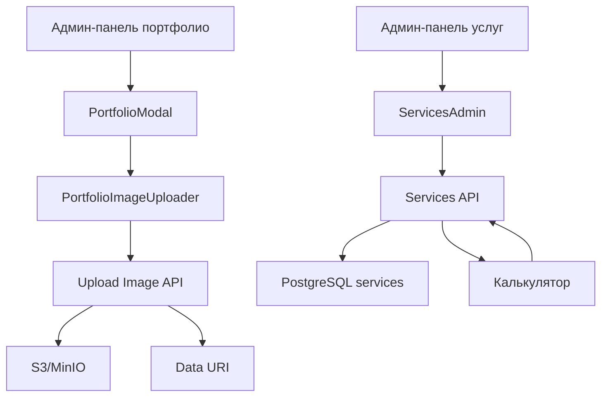

# План работ по восстановлению функционала портфолио и услуг
Дата: 2026-01-20

## 1. Обзор текущего состояния

### Проблемы
1. **Блок портфолио**: загрузка картинок проекта не работает.
2. **Услуги в админ-панели**: сохранение не работает, таблица `services` отсутствует в базе данных.
3. **Интеграция с калькулятором**: услуги должны правильно отображаться в калькуляторе.

### Анализ
- Компонент `PortfolioAdmin` использует API `/api/99ddd15c-93b5-4d9e-8536-31e6f6630304` (функция `portfolio`).
- Загрузка изображений через `/api/6f0735b1-7477-4660-b2b0-0b694b4f36ea` (функция `upload-image`).
- Услуги используют API `/api/91a16400-6baa-4748-9387-c7cdad64ce9c` (функция `services-admin`).
- База данных содержит таблицу `portfolio`, но отсутствует `services`.
- Конфигурация S3 в `.env` присутствует, но требуется проверка доступности MinIO.

## 2. Детальный план работ

### Этап 1: Восстановление загрузки изображений для портфолио
1. **Проверка доступности MinIO**
   - Убедиться, что S3 эндпоинт `http://localhost:9000` доступен.
   - Проверить учетные данные в `.env` (S3_ACCESS_KEY, S3_SECRET_KEY).

2. **Тестирование API загрузки**
   - Выполнить тестовый запрос к `/api/6f0735b1-7477-4660-b2b0-0b694b4f36ea` с валидным base64.

3. **Добавление поддержки PDF**
   - Модифицировать `PortfolioImageUploader.tsx` и `upload-image/index.py` для обработки PDF файлов.
   - Определить MIME type `application/pdf` и сохранять с правильным расширением.

4. **Адаптивное отображение в блоке портфолио**
   - Пересмотреть компонент `PortfolioGallery` для отображения PDF как ссылки или иконки.
   - Обеспечить адаптивность сетки изображений.

5. **Превью в модальном окне**
   - Модифицировать `PortfolioPreview` для показа миниатюр PDF.

### Этап 2: Восстановление таблицы services
1. **Создание таблицы**
   - Выполнить SQL скрипт (прилагается ниже).
   - Создать индексы и триггеры.

2. **Наполнение тестовыми данными**
   - Вставить базовый набор услуг.

3. **Проверка CRUD операций**
   - Протестировать создание, редактирование, удаление услуг через админ-панель.

### Этап 3: Исправление бэкенда услуг
1. **Исправление уязвимостей SQL-инъекций**
   - Заменить конкатенацию строк на параметризованные запросы.
   - Модифицировать `backend/services-admin/index.py`.

2. **Добавление валидации полей**
   - Проверять обязательные поля перед сохранением.
   - Обрабатывать ошибки с корректными HTTP статусами.

3. **Тестирование API**
   - Использовать тесты из `backend/services-admin/tests.json`.

### Этап 4: Интеграция с калькулятором
1. **Проверка загрузки услуг**
   - Убедиться, что `CalcModal.tsx` корректно загружает и отображает услуги.

2. **Обновление данных**
   - После восстановления таблицы проверить отображение в калькуляторе.

3. **Скидки для партнёров**
   - Проверить функцию `getDiscountedPrice` из `PartnerContext`.

### Этап 5: Тестирование и развёртывание
1. **Фронтенд-тесты**
   - Проверить UI портфолио и админ-панели.

2. **Бэкенд-тесты**
   - Запустить тесты для `upload-image` и `services-admin`.

3. **Деплой**
   - Применить изменения на продакшене.

## 3. SQL скрипт для создания таблицы services
```sql
-- Сохранить в scripts/create_services_table.sql
CREATE TABLE IF NOT EXISTS services (
    id SERIAL PRIMARY KEY,
    service_id VARCHAR(50) UNIQUE NOT NULL,
    category VARCHAR(20) NOT NULL CHECK (category IN ('development', 'promotion', 'additional')),
    title VARCHAR(200) NOT NULL,
    description TEXT,
    price INTEGER NOT NULL DEFAULT 0,
    is_active BOOLEAN NOT NULL DEFAULT true,
    display_order INTEGER NOT NULL DEFAULT 0,
    created_at TIMESTAMP DEFAULT CURRENT_TIMESTAMP,
    updated_at TIMESTAMP DEFAULT CURRENT_TIMESTAMP
);

CREATE INDEX IF NOT EXISTS idx_services_category ON services(category);
CREATE INDEX IF NOT EXISTS idx_services_is_active ON services(is_active);
CREATE INDEX IF NOT EXISTS idx_services_display_order ON services(display_order);

CREATE OR REPLACE FUNCTION update_updated_at_column()
RETURNS TRIGGER AS $$
BEGIN
    NEW.updated_at = CURRENT_TIMESTAMP;
    RETURN NEW;
END;
$$ language 'plpgsql';

DROP TRIGGER IF EXISTS update_services_updated_at ON services;
CREATE TRIGGER update_services_updated_at
    BEFORE UPDATE ON services
    FOR EACH ROW
    EXECUTE FUNCTION update_updated_at_column();

INSERT INTO services (service_id, category, title, description, price, is_active, display_order) VALUES
    ('corporate', 'development', 'Корпоративный сайт', 'Профессиональная платформа для презентации вашей компании', 150000, true, 1),
    ('landing', 'development', 'Лендинг', 'Одностраничный сайт для быстрого привлечения клиентов', 50000, true, 2),
    ('seo', 'promotion', 'SEO-продвижение', 'Поисковая оптимизация для роста трафика', 30000, true, 3),
    ('context', 'promotion', 'Контекстная реклама', 'Таргетированная реклама в Яндекс.Директ и Google Ads', 20000, true, 4),
    ('support', 'additional', 'Техническая поддержка', 'Ежемесячное обслуживание и обновления', 10000, true, 5)
ON CONFLICT (service_id) DO NOTHING;
```

## 4. Необходимые изменения в коде

### Для загрузки PDF:
1. **PortfolioImageUploader.tsx**: добавить проверку `file.type === 'application/pdf'`.
2. **upload-image/index.py**: расширить `content_type_map` для PDF.
3. **PortfolioGallery.tsx**: отображать иконку PDF вместо изображения.

### Для исправления SQL-инъекций:
1. **services-admin/index.py**: заменить конкатенацию на параметризованные запросы `cursor.execute("SELECT ...", (param,))`.

## 5. Диаграмма взаимодействия


## 6. Риски и допущения
- MinIO работает локально и доступен.
- База данных PostgreSQL имеет права на создание таблиц.
- Фронтенд-сборка проходит без ошибок.
- Пользовательские данные не будут потеряны.

## 7. Ожидаемый результат
- Загрузка изображений и PDF в портфолио работает.
- Услуги сохраняются, редактируются, активируются/деактивируются.
- Калькулятор отображает актуальный список услуг.
- Адаптивное отображение портфолио на всех устройствах.

## 8. Следующие шаги
1. Согласовать план с заказчиком.
2. Переключиться в режим Code для реализации.
3. Выполнить SQL скрипт вручную или через миграцию.
4. Производить изменения последовательно, тестируя каждый этап.
